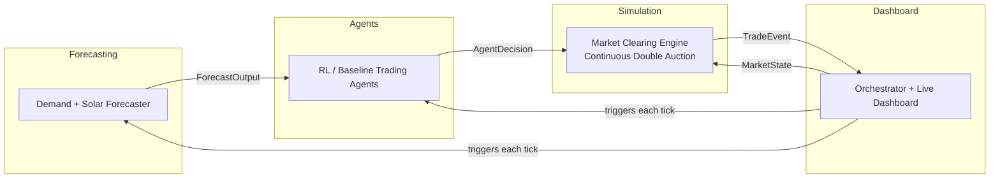

# GridPeer — AI-Driven Peer-to-Peer Energy Trading Marketplace

Households with solar panels and batteries mostly export surplus power back to the grid at a low fixed tariff instead of trading it directly with a neighbour who needs it right now. GridPeer is a simulated microgrid marketplace where households are represented by learning agents that bid and sell energy directly with each other, cleared through an automated market, with a dashboard that shows the real-world outcome: money saved, CO2 avoided, and grid strain reduced versus the "just export to the grid" baseline.

This is not a dashboard project. It's a working multi-agent system: a market simulation, reinforcement-learning agents that learn to trade, a forecasting layer feeding their decisions, and an outcomes dashboard — four real components, four owners, one shared contract holding it together.

## Why this project

- **Real problem.** Renewable integration and grid balancing are live policy problems, not toy datasets.
- **Real data.** Built on the CER Smart Metering Trial (Ireland) — real household consumption at half-hour resolution, plus PVGIS for solar generation estimates. See `data/README.md`.
- **Real differentiation.** Most student versions of P2P energy trading stop at a rule-based pricing script. This one has agents that actually learn a bidding strategy, benchmarked against that rule-based baseline — the comparison *is* the result.
- **Genuinely parallel.** Four independent modules behind one shared contract, so four people can build at the same time without stepping on each other.

## Architecture



Every arrow above is a typed contract defined once, in `shared/schemas.py`. No module imports another module's internals — they only exchange these contracts. That rule is what keeps four people from blocking each other.

## Repo layout

```
gridpeer/
├── shared/         # The contracts. Single source of truth. Changes need sign-off from all 4.
├── simulation/      # Market clearing mechanism + household environment
├── agents/          # RL + baseline trading agents
├── forecasting/      # Demand + solar generation forecasting
├── dashboard/        # Orchestration loop + live dashboard
├── data/             # Dataset access instructions + synthetic data fallback
├── tests/            # Cross-module contract tests
├── AGENTS.md          # Root context for AI coding assistants
├── ROADMAP.md         # Week-by-week build plan with owners
└── CONTRIBUTING.md    # Branching, commit, and schema-change rules
```

## Tech stack

| Layer | Choice | Why |
|---|---|---|
| Contracts | Pydantic v2 | Runtime-validated, typed, self-documenting |
| Simulation | Custom loop (no framework) | The mechanism is specific enough that a generic ABM framework adds more learning overhead than it saves |
| Agents | PettingZoo + Stable-Baselines3 | Standard multi-agent RL environment API; SB3 is well-documented enough for a 4-person team to actually finish training, not just start it |
| Forecasting | LightGBM / Prophet | Reliable and fast to iterate — swap for something fancier later, behind the same contract |
| Dashboard (weeks 1–3) | Streamlit | Get a working view of the system fast, don't burn time on frontend plumbing while the core is unstable |
| Dashboard (week 4+, optional) | FastAPI + React | Only once the system underneath is stable — polishing a UI to data that's still changing shape is wasted work |
| Storage | SQLite / DuckDB | Zero infra overhead, plenty for this scale |
| Env | Docker Compose | All four laptops run an identical environment |

## Quick start

```bash
git clone https://github.com/<your-org-or-username>/gridpeer.git
cd gridpeer
make setup      # creates venv, installs deps
make test       # runs the contract tests — should pass on a fresh clone
make run-sim    # runs the pipeline end to end and persists a run to data/gridpeer.db
make ai-context # optional: local CLAUDE.md symlinks, if you use Claude Code
```

See `AGENTS.md` for how AI coding assistants should work in this repo, and `ROADMAP.md` for the week-by-week plan.

The per-module context lives in `AGENTS.md` files, which most coding assistants read
directly. Claude Code reads `CLAUDE.md` only, so `make ai-context` symlinks
`CLAUDE.md -> AGENTS.md` in each module. Those symlinks are gitignored — the
committed context files are the `AGENTS.md` ones.

## Team

| Module | Owner | Focus |
|---|---|---|
| Simulation & market mechanism | _TBD_ | Continuous double auction, household environment |
| RL / trading agents | _TBD_ | Baseline + RL bidding strategy, evaluation harness |
| Forecasting | _TBD_ | Demand + solar generation forecasting |
| Orchestration & dashboard | _TBD_ | Simulation loop, persistence, live outcomes dashboard |

Fill this in once roles are picked — see the "Deciding roles" section of `ROADMAP.md`.

## License

MIT — see `LICENSE`.
